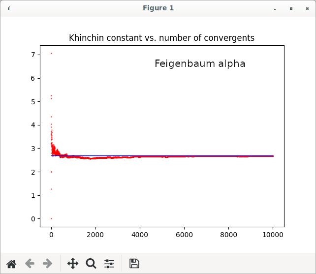
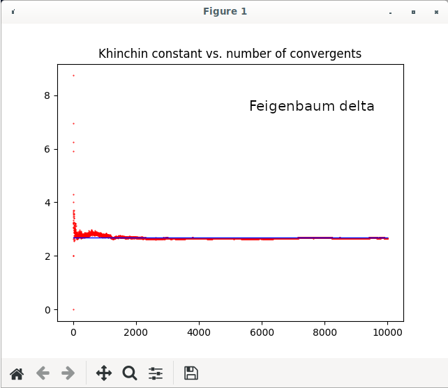

The stuff in this directory involves computing the continued
fraction expansion of the Feigenbaum constants delta
and alpha.  I compute the simple continued fraction expansion
of each, e.g. 

delta = a1 + 1/(a2 + 1/(a3 + ....

The program makes a plot of the the sequence of coefficients
a1, a2, a3, ...  I use the mpfr library to compute the
expansions to high order.

I make a plot of a vs. order.  If the continued fraction was
periodic I would observe periodicity in the plot.  However,
I see none.

The python program uses the value of delta from Andrea Molteni's
website to get the value of alpha and delta:

http://converge.to/feigenbaum/alpha.txt

http://converge.to/feigenbaum/delta.txt

I also compute the Khinchin constant as described in
https://en.wikipedia.org/wiki/Khinchin%27s_constant
and make a plot of the computed constant vs. number of
convergents computed.  I find the expansions of both 
alpha and delta converge to the Khinchin constant.  
Both plots are shown below.

To test the program I have a facility to create high-precision
representations of the square root of numbers, for example
sqrt2, sqrt3, etc.  Square roots yeild simple continued fraction
expansions which repeat, and the repeating digits are known and
tabulated (e.g. Wolfram MathWorld).  Therefore, I can use
the known coefficients from the continued fraction expansions
of these quantities to test my program.

Stuart Brorson
February 2021
